### OKR Term-Project Report

> Selin Çırak 21011603

---

**Table of Contents**

1. **Overview**
2. **System Design**
    - 2.1 Software Design
    - 2.2 Interface Design
    - 2.3 Database Design
3. **Stored Procedures**
    - 3.1 Calculate Objective Progress
    - 3.2 Get Notifications for User
    - 3.3 Assign Task to User
    - 3.4 Create Objective
    - 3.5 Update Objective Progress
    - 3.6 Create Sprint
    - 3.7 Assign User to Team
    - 3.8 Update Task Status
    - 3.9 Mark Notification as Read
    - 3.10 Delete Objective
4. **Use Case Sequence Diagrams**
    - 4.1 Sequence Diagram: Adding an Objective
    - 4.2 Sequence Diagram: Assigning a Task
    - 4.3 Sequence Diagram: Viewing Notifications
    - 4.4 Sequence Diagram: Creating an Objective with Key Results
    - 4.5 Sequence Diagram: Updating the Progress of a Key Result
    - 4.6 Sequence Diagram: Assigning a Sprint Task to a Team Member
    - 4.7 Sequence Diagram: Sending Notifications to Users
    - 4.8 Sequence Diagram: Creating a Team and Adding Members
    - 4.9 Sequence Diagram: Generating a Report
5. **API Documentation**
    - 5.x API endpoints

---

## 1. Overview

The OKR project is a system designed to help organizations manage their Objectives and Key Results efficiently. The system offers a backend written in Go (using the Fiber framework), a frontend powered by React and Zustand, and Docker for containerization. The backend focuses on handling user management, objectives, key results, notifications, and reporting, while the frontend provides a user-friendly interface for managing and tracking OKRs.

---

## 2. System Design

### 2.1 Software Design

The system follows a modular, microservice architecture where each service is responsible for a specific domain, and all services communicate through RESTful APIs. Services are containerized using Docker to allow for easy deployment and scalability.

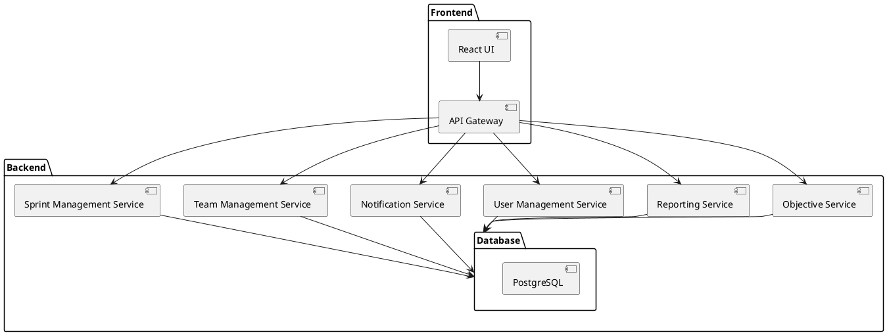
```plantuml
@startuml
package "Frontend" {
  [React UI] --> [API Gateway]
}

package "Backend" {
  [API Gateway] --> [Objective Service]
  [API Gateway] --> [Reporting Service]
  [API Gateway] --> [User Management Service]
  [API Gateway] --> [Notification Service]
  [API Gateway] --> [Team Management Service]
  [API Gateway] --> [Sprint Management Service]
  [Objective Service] --> [Database]
  [Reporting Service] --> [Database]
  [User Management Service] --> [Database]
  [Notification Service] --> [Database]
  [Team Management Service] --> [Database]
  [Sprint Management Service] --> [Database]
}

package "Database" {
  [PostgreSQL]
}
@enduml
```

#### Backend Modules:

-   **User Management Service**: Handles authentication, user roles, and team management.
-   **Objective Service**: Manages objectives, key results, and associated comments.
-   **Reporting Service**: Generates detailed reports and graphs for insights.
-   **Notification Service**: Manages user notifications and system alerts.
-   **Team Management Service**: Manages team creation and assignment of team members to objectives.
-   **Sprint Management Service**: Handles the management of sprint tasks and assignments.

#### Deployment Workflow:

-   Services are deployed in isolated Docker containers.
-   The backend services are orchestrated via an **API Gateway** to route requests.
-   All data is stored in a PostgreSQL database.

### 2.2 Interface Design

Screenshots from Figma design sheet:

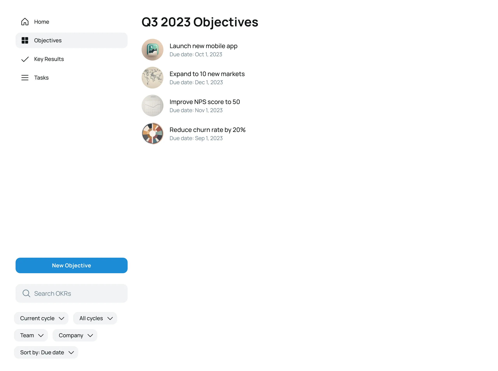
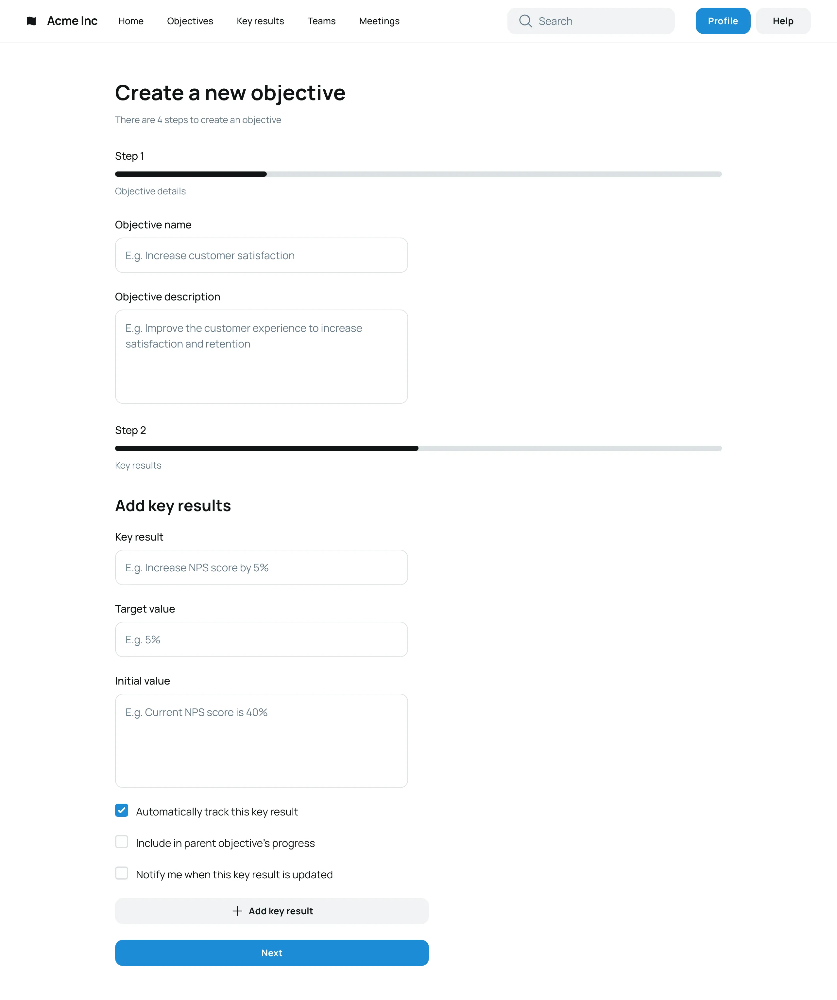
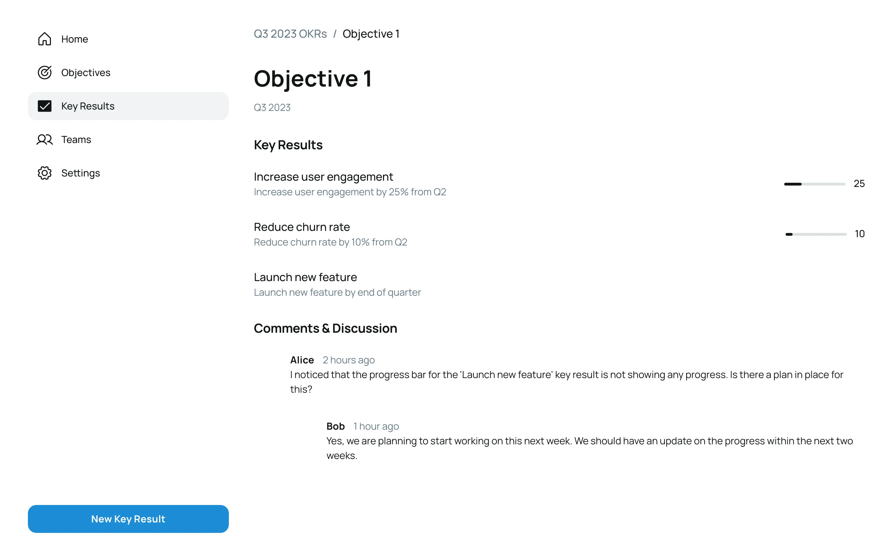
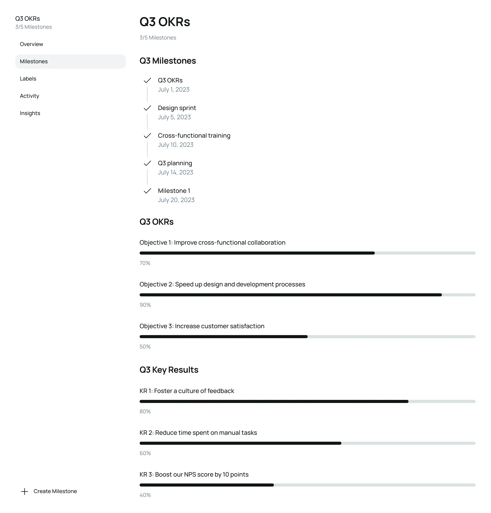
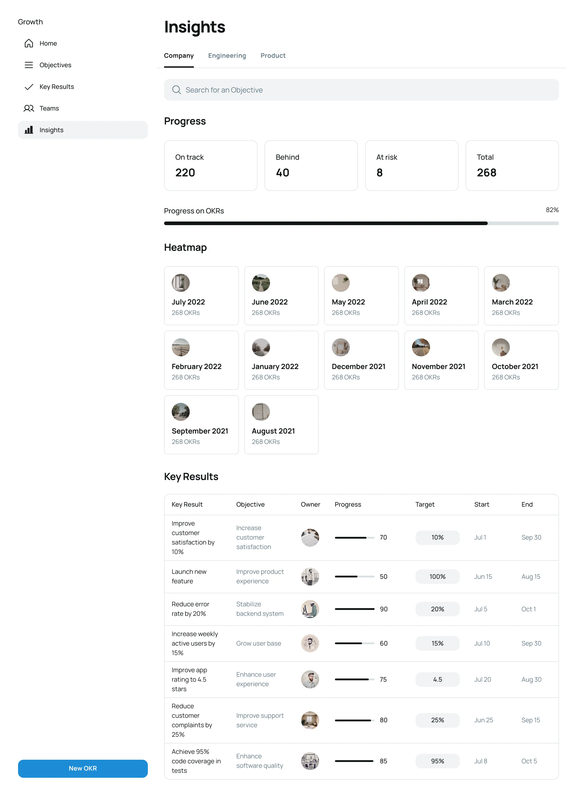
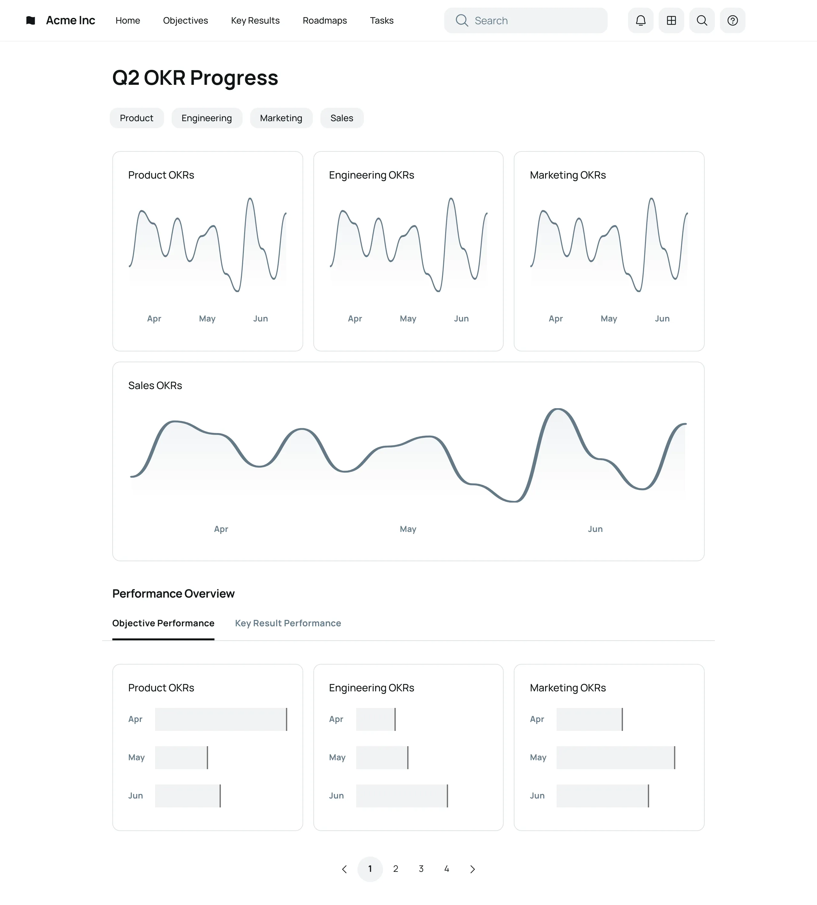
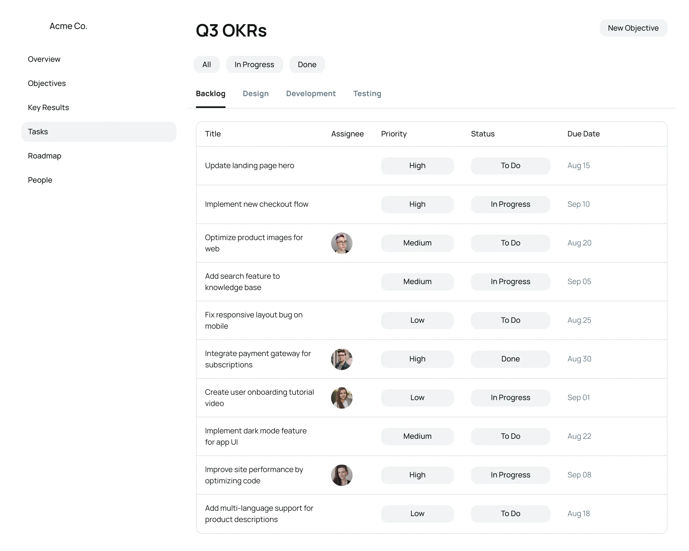
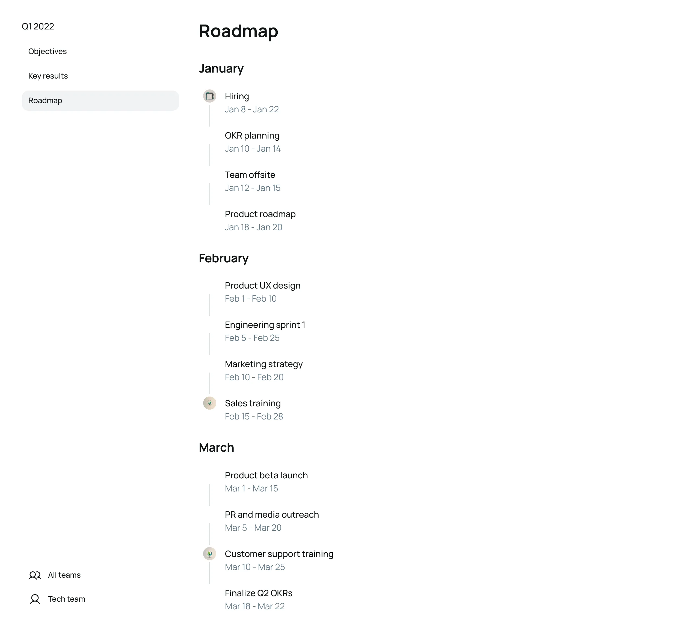

### 2.3 Database Design

The PostgreSQL database stores all data related to users, objectives, key results, notifications, and more. Below is the updated Entity-Relationship (E-R) diagram:

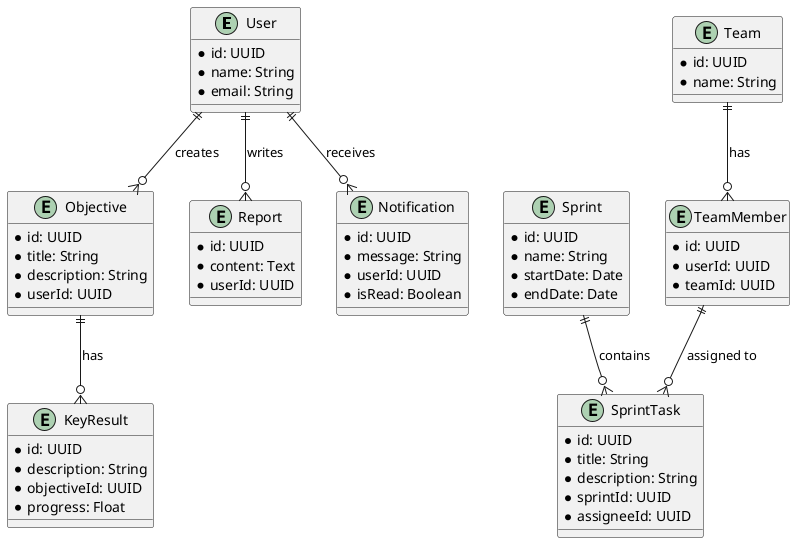
```plantuml
@startuml
entity User {
  * id: UUID
  * name: String
  * email: String
}

entity Objective {
  * id: UUID
  * title: String
  * description: String
  * userId: UUID
}

entity KeyResult {
  * id: UUID
  * description: String
  * objectiveId: UUID
  * progress: Float
}

entity Report {
  * id: UUID
  * content: Text
  * userId: UUID
}

entity Sprint {
  * id: UUID
  * name: String
  * startDate: Date
  * endDate: Date
}

entity SprintTask {
  * id: UUID
  * title: String
  * description: String
  * sprintId: UUID
  * assigneeId: UUID
}

entity Team {
  * id: UUID
  * name: String
}

entity TeamMember {
  * id: UUID
  * userId: UUID
  * teamId: UUID
}

entity Notification {
  * id: UUID
  * message: String
  * userId: UUID
  * isRead: Boolean
}

User ||--o{ Objective : "creates"
Objective ||--o{ KeyResult : "has"
User ||--o{ Report : "writes"
User ||--o{ Notification : "receives"
Team ||--o{ TeamMember : "has"
Sprint ||--o{ SprintTask : "contains"
TeamMember ||--o{ SprintTask : "assigned to"
@enduml
```

---

## 3. Stored Procedures

### Updated Stored Procedures

#### Calculate Objective Progress

```sql
CREATE OR REPLACE FUNCTION CalculateObjectiveProgress(objective_id UUID)
RETURNS FLOAT AS $$
DECLARE
  total_progress FLOAT;
BEGIN
  SELECT AVG(progress) INTO total_progress
  FROM KeyResult
  WHERE objectiveId = objective_id;

  RETURN total_progress;
END;
$$ LANGUAGE plpgsql;
```

#### Get Notifications for User

```sql
CREATE OR REPLACE FUNCTION GetUserNotifications(user_id UUID)
RETURNS TABLE(id UUID, message TEXT, isRead BOOLEAN) AS $$
BEGIN
  RETURN QUERY SELECT id, message, isRead
  FROM Notification
  WHERE userId = user_id;
END;
$$ LANGUAGE plpgsql;
```

#### Assign Task to User

```sql
CREATE OR REPLACE FUNCTION AssignTaskToUser(task_id UUID, user_id UUID)
RETURNS VOID AS $$
BEGIN
  UPDATE SprintTask
  SET assigneeId = user_id
  WHERE id = task_id;
END;
$$ LANGUAGE plpgsql;
```

#### Create Objective

```sql
CREATE OR REPLACE FUNCTION CreateObjective(title TEXT, description TEXT, user_id UUID)
RETURNS UUID AS $$
DECLARE
  objective_id UUID;
BEGIN
  INSERT INTO Objective (title, description, userId)
  VALUES (title, description, user_id)
  RETURNING id INTO objective_id;

  RETURN objective_id;
END;
$$ LANGUAGE plpgsql;
```

#### Update Objective Progress

```sql
CREATE OR REPLACE FUNCTION UpdateObjectiveProgress(objective_id UUID)
RETURNS VOID AS $$
DECLARE
  total_progress FLOAT;
BEGIN
  -- Calculate the average progress of all key results related to this objective
  SELECT AVG(progress) INTO total_progress
  FROM KeyResult
  WHERE objectiveId = objective_id;

  -- Update the objective's progress field
  UPDATE Objective
  SET progress = total_progress
  WHERE id = objective_id;
END;
$$ LANGUAGE plpgsql;
```

#### Create Sprint

```sql
CREATE OR REPLACE FUNCTION CreateSprint(name TEXT, start_date DATE, end_date DATE)
RETURNS UUID AS $$
DECLARE
  sprint_id UUID;
BEGIN
  INSERT INTO Sprint (name, startDate, endDate)
  VALUES (name, start_date, end_date)
  RETURNING id INTO sprint_id;

  RETURN sprint_id;
END;
$$ LANGUAGE plpgsql;
```

#### Assign User to Team

```sql
CREATE OR REPLACE FUNCTION AssignUserToTeam(user_id UUID, team_id UUID)
RETURNS VOID AS $$
BEGIN
  INSERT INTO TeamMember (userId, teamId)
  VALUES (user_id, team_id);
END;
$$ LANGUAGE plpgsql;

```

#### Update Task Status

```sql
CREATE OR REPLACE FUNCTION UpdateTaskStatus(task_id UUID, status TEXT)
RETURNS VOID AS $$
BEGIN
  UPDATE SprintTask
  SET status = status
  WHERE id = task_id;
END;
$$ LANGUAGE plpgsql;
```

#### Mark notification read

```sql
CREATE OR REPLACE FUNCTION MarkNotificationAsRead(notification_id UUID)
RETURNS VOID AS $$
BEGIN
  UPDATE Notification
  SET isRead = TRUE
  WHERE id = notification_id;
END;
$$ LANGUAGE plpgsql;
```

#### Delete Objective

```sql
CREATE OR REPLACE FUNCTION DeleteObjective(objective_id UUID)
RETURNS VOID AS $$
BEGIN
  -- Delete related key results first
  DELETE FROM KeyResult
  WHERE objectiveId = objective_id;

  -- Then delete the objective itself
  DELETE FROM Objective
  WHERE id = objective_id;
END;
$$ LANGUAGE plpgsql;
```

---

## 4. Use Case Sequence Diagrams

### Sequence Diagram: Adding an Objective

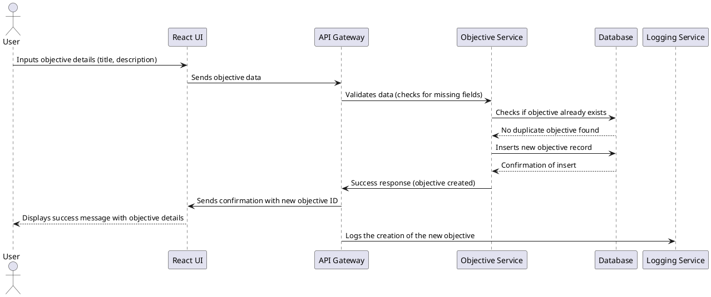
```plantuml
@startuml
actor User
User -> "React UI": Inputs objective details (title, description)
"React UI" -> "API Gateway": Sends objective data
"API Gateway" -> "Objective Service": Validates data (checks for missing fields)
"Objective Service" -> "Database": Checks if objective already exists
"Database" --> "Objective Service": No duplicate objective found
"Objective Service" -> "Database": Inserts new objective record
"Database" --> "Objective Service": Confirmation of insert
"Objective Service" -> "API Gateway": Success response (objective created)
"API Gateway" -> "React UI": Sends confirmation with new objective ID
"React UI" --> "User": Displays success message with objective details
"API Gateway" -> "Logging Service": Logs the creation of the new objective
@enduml

```

### Sequence Diagram: Assigning a Task

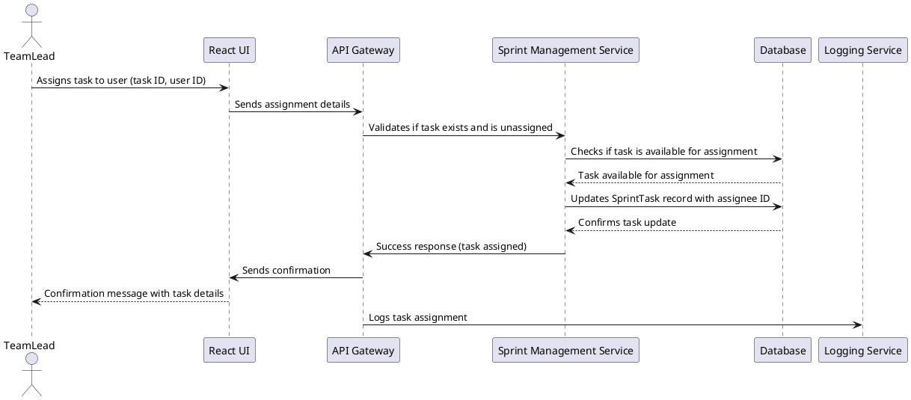
```plantuml
@startuml
actor TeamLead
"TeamLead" -> "React UI": Assigns task to user (task ID, user ID)
"React UI" -> "API Gateway": Sends assignment details
"API Gateway" -> "Sprint Management Service": Validates if task exists and is unassigned
"Sprint Management Service" -> "Database": Checks if task is available for assignment
"Database" --> "Sprint Management Service": Task available for assignment
"Sprint Management Service" -> "Database": Updates SprintTask record with assignee ID
"Database" --> "Sprint Management Service": Confirms task update
"Sprint Management Service" -> "API Gateway": Success response (task assigned)
"API Gateway" -> "React UI": Sends confirmation
"React UI" --> "TeamLead": Confirmation message with task details
"API Gateway" -> "Logging Service": Logs task assignment
@enduml

```

### Sequence Diagram: Viewing Notifications

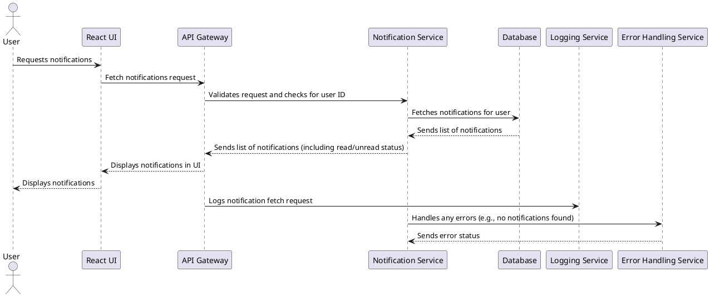
```plantuml
@startuml
actor User
"User" -> "React UI": Requests notifications
"React UI" -> "API Gateway": Fetch notifications request
"API Gateway" -> "Notification Service": Validates request and checks for user ID
"Notification Service" -> "Database": Fetches notifications for user
"Database" --> "Notification Service": Sends list of notifications
"Notification Service" --> "API Gateway": Sends list of notifications (including read/unread status)
"API Gateway" --> "React UI": Displays notifications in UI
"React UI" --> "User": Displays notifications
"API Gateway" -> "Logging Service": Logs notification fetch request
"Notification Service" -> "Error Handling Service": Handles any errors (e.g., no notifications found)
"Error Handling Service" --> "Notification Service": Sends error status
@enduml
```

#### Sequence Diagram 4: Creating an Objective with Key Results

This diagram represents the flow when a user creates an objective and adds key results to it.

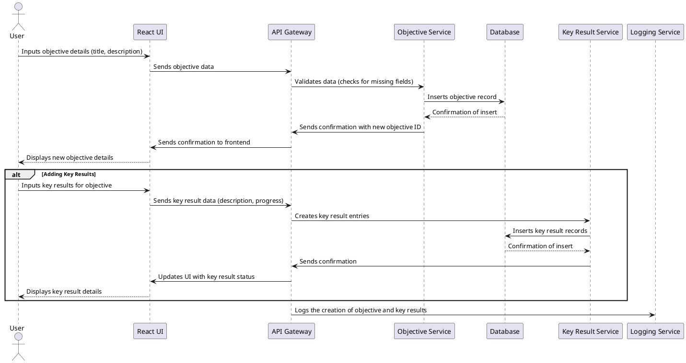
```plantuml
@startuml
actor User
User -> "React UI": Inputs objective details (title, description)
"React UI" -> "API Gateway": Sends objective data
"API Gateway" -> "Objective Service": Validates data (checks for missing fields)
"Objective Service" -> "Database": Inserts objective record
"Database" --> "Objective Service": Confirmation of insert
"Objective Service" -> "API Gateway": Sends confirmation with new objective ID
"API Gateway" -> "React UI": Sends confirmation to frontend
"React UI" --> "User": Displays new objective details

alt Adding Key Results
  User -> "React UI": Inputs key results for objective
  "React UI" -> "API Gateway": Sends key result data (description, progress)
  "API Gateway" -> "Key Result Service": Creates key result entries
  "Key Result Service" -> "Database": Inserts key result records
  "Database" --> "Key Result Service": Confirmation of insert
  "Key Result Service" -> "API Gateway": Sends confirmation
  "API Gateway" -> "React UI": Updates UI with key result status
  "React UI" --> "User": Displays key result details
end

"API Gateway" -> "Logging Service": Logs the creation of objective and key results
@enduml
```

### **Sequence Diagram 5: Updating the Progress of a Key Result**

This sequence demonstrates the flow when a user updates the progress of a key result.

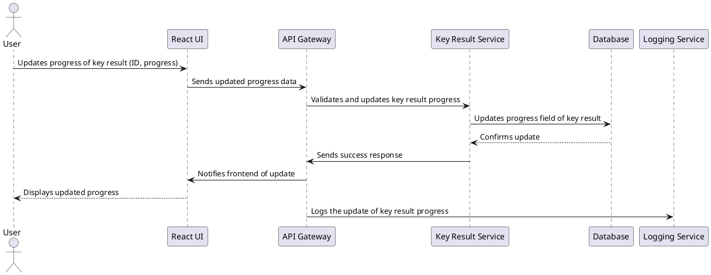
```plantuml
@startuml
actor User
User -> "React UI": Updates progress of key result (ID, progress)
"React UI" -> "API Gateway": Sends updated progress data
"API Gateway" -> "Key Result Service": Validates and updates key result progress
"Key Result Service" -> "Database": Updates progress field of key result
"Database" --> "Key Result Service": Confirms update
"Key Result Service" -> "API Gateway": Sends success response
"API Gateway" -> "React UI": Notifies frontend of update
"React UI" --> "User": Displays updated progress
"API Gateway" -> "Logging Service": Logs the update of key result progress
@enduml
```

### **Sequence Diagram 6: Assigning a Sprint Task to a Team Member**

This sequence illustrates the process of assigning a sprint task to a team member.

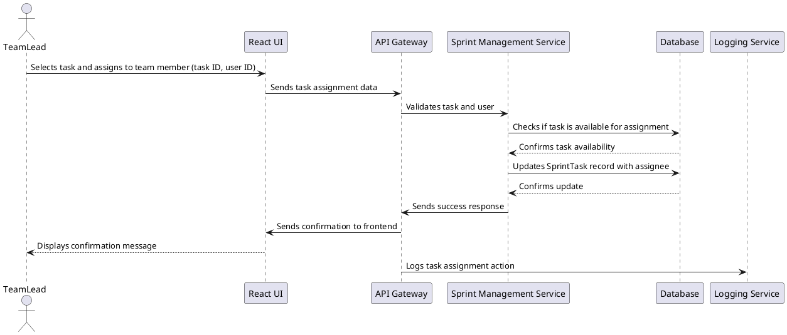
```plantuml
@startuml
actor TeamLead
TeamLead -> "React UI": Selects task and assigns to team member (task ID, user ID)
"React UI" -> "API Gateway": Sends task assignment data
"API Gateway" -> "Sprint Management Service": Validates task and user
"Sprint Management Service" -> "Database": Checks if task is available for assignment
"Database" --> "Sprint Management Service": Confirms task availability
"Sprint Management Service" -> "Database": Updates SprintTask record with assignee
"Database" --> "Sprint Management Service": Confirms update
"Sprint Management Service" -> "API Gateway": Sends success response
"API Gateway" -> "React UI": Sends confirmation to frontend
"React UI" --> "TeamLead": Displays confirmation message
"API Gateway" -> "Logging Service": Logs task assignment action
@enduml
```

### **Sequence Diagram 7: Sending Notifications to Users**

This sequence diagram shows how the notification system works when a new notification is generated and sent to a user.

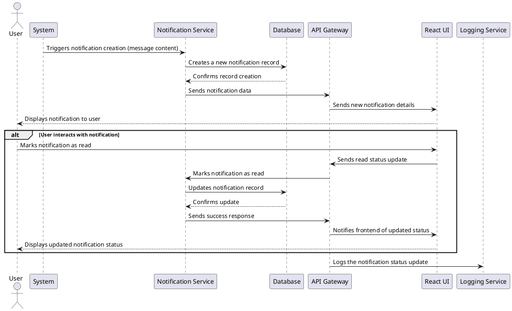
```plantuml
@startuml
actor User
"System" -> "Notification Service": Triggers notification creation (message content)
"Notification Service" -> "Database": Creates a new notification record
"Database" --> "Notification Service": Confirms record creation
"Notification Service" -> "API Gateway": Sends notification data
"API Gateway" -> "React UI": Sends new notification details
"React UI" --> "User": Displays notification to user

alt User interacts with notification
  User -> "React UI": Marks notification as read
  "React UI" -> "API Gateway": Sends read status update
  "API Gateway" -> "Notification Service": Marks notification as read
  "Notification Service" -> "Database": Updates notification record
  "Database" --> "Notification Service": Confirms update
  "Notification Service" -> "API Gateway": Sends success response
  "API Gateway" -> "React UI": Notifies frontend of updated status
  "React UI" --> "User": Displays updated notification status
end

"API Gateway" -> "Logging Service": Logs the notification status update
@enduml
```

### **Sequence Diagram 8: Creating a Team and Adding Members**

This sequence shows the flow when a team is created and members are assigned to the team.

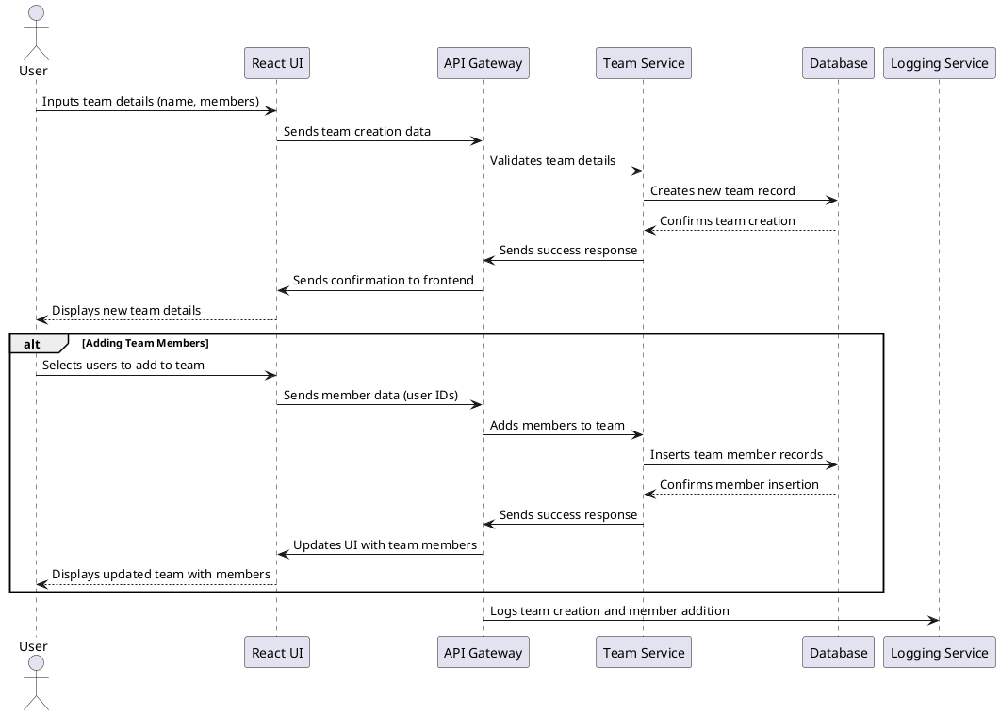
```plantuml
@startuml
actor User
User -> "React UI": Inputs team details (name, members)
"React UI" -> "API Gateway": Sends team creation data
"API Gateway" -> "Team Service": Validates team details
"Team Service" -> "Database": Creates new team record
"Database" --> "Team Service": Confirms team creation
"Team Service" -> "API Gateway": Sends success response
"API Gateway" -> "React UI": Sends confirmation to frontend
"React UI" --> "User": Displays new team details

alt Adding Team Members
  User -> "React UI": Selects users to add to team
  "React UI" -> "API Gateway": Sends member data (user IDs)
  "API Gateway" -> "Team Service": Adds members to team
  "Team Service" -> "Database": Inserts team member records
  "Database" --> "Team Service": Confirms member insertion
  "Team Service" -> "API Gateway": Sends success response
  "API Gateway" -> "React UI": Updates UI with team members
  "React UI" --> "User": Displays updated team with members
end

"API Gateway" -> "Logging Service": Logs team creation and member addition
@enduml
```

---

### **Sequence Diagram 9: Generating a Report**

This diagram illustrates the process for generating a report on the user's objectives or key results.

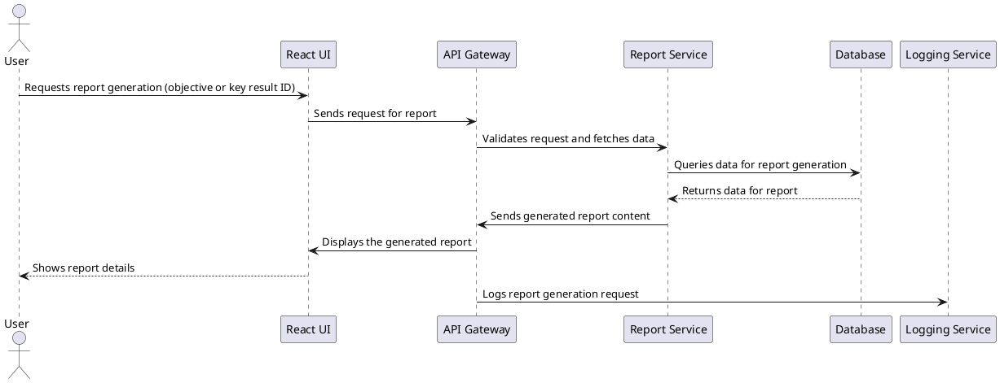
```plantuml
@startuml
actor User
User -> "React UI": Requests report generation (objective or key result ID)
"React UI" -> "API Gateway": Sends request for report
"API Gateway" -> "Report Service": Validates request and fetches data
"Report Service" -> "Database": Queries data for report generation
"Database" --> "Report Service": Returns data for report
"Report Service" -> "API Gateway": Sends generated report content
"API Gateway" -> "React UI": Displays the generated report
"React UI" --> "User": Shows report details
"API Gateway" -> "Logging Service": Logs report generation request
@enduml
```

---

### API Documentation

Below is the comprehensive API documentation for the OKR (Objectives and Key Results) system. This documentation covers various aspects of the system, including authentication, managing objectives, reports, notifications, tasks, and teams.

---

## 1. Authentication

-   **POST /auth/login**

    This endpoint is used for logging in and obtaining an authentication token.

    -   **Request Body:**

        ```json
        {
            "email": "string",
            "password": "string"
        }
        ```

    -   **Response:**
        ```json
        {
            "token": "string"
        }
        ```

---

## 2. Objectives

### **POST /objectives**

This endpoint creates a new objective.

-   **Request Body:**

    ```json
    {
        "title": "string",
        "description": "string",
        "userId": "UUID"
    }
    ```

-   **Response:**
    ```json
    {
        "id": "UUID",
        "title": "string"
    }
    ```

### **GET /objectives**

This endpoint retrieves a list of objectives for the authenticated user.

-   **Response:**
    ```json
    [
        {
            "id": "UUID",
            "title": "string",
            "progress": 0.5
        }
    ]
    ```

---

## 3. Key Results

### **POST /keyresults**

This endpoint allows the creation of a new key result under an objective.

-   **Request Body:**

    ```json
    {
        "description": "string",
        "objectiveId": "UUID",
        "progress": 0.0
    }
    ```

-   **Response:**
    ```json
    {
        "id": "UUID",
        "description": "string",
        "progress": 0.0
    }
    ```

### **GET /keyresults**

This endpoint retrieves the list of key results for the objectives.

-   **Response:**
    ```json
    [
        {
            "id": "UUID",
            "description": "string",
            "progress": 0.0
        }
    ]
    ```

### **PUT /keyresults/{id}/update**

This endpoint updates the progress of a key result.

-   **Request Body:**

    ```json
    {
        "progress": 0.75
    }
    ```

-   **Response:**
    ```json
    {
        "id": "UUID",
        "description": "string",
        "progress": 0.75
    }
    ```

---

## 4. Reports

### **GET /reports**

This endpoint retrieves a list of reports written by the user.

-   **Response:**
    ```json
    [
        {
            "id": "UUID",
            "content": "string"
        }
    ]
    ```

---

## 5. Notifications

### **GET /notifications**

This endpoint retrieves the list of notifications for the authenticated user.

-   **Response:**
    ```json
    [
        {
            "id": "UUID",
            "message": "string",
            "isRead": false
        }
    ]
    ```

### **POST /notifications/read**

This endpoint marks a notification as read.

-   **Request Body:**

    ```json
    {
        "id": "UUID"
    }
    ```

-   **Response:**
    ```json
    {
        "status": "success"
    }
    ```

---

## 6. Tasks and Sprints

### **POST /tasks/assign**

This endpoint assigns a sprint task to a user (team member).

-   **Request Body:**

    ```json
    {
        "taskId": "UUID",
        "userId": "UUID"
    }
    ```

-   **Response:**
    ```json
    {
        "status": "success"
    }
    ```

---

## 7. Teams

### **GET /teams**

This endpoint retrieves the list of teams in the system.

-   **Response:**
    ```json
    [
        {
            "id": "UUID",
            "name": "Team Name"
        }
    ]
    ```

### **POST /teams**

This endpoint creates a new team.

-   **Request Body:**

    ```json
    {
        "name": "string"
    }
    ```

-   **Response:**
    ```json
    {
        "id": "UUID",
        "name": "string"
    }
    ```

### **POST /teams/{teamId}/members**

This endpoint adds a member to an existing team.

-   **Request Body:**

    ```json
    {
        "userId": "UUID"
    }
    ```

-   **Response:**
    ```json
    {
        "status": "success"
    }
    ```

---

## 8. Sprints

### **GET /sprints**

This endpoint retrieves all the sprints.

-   **Response:**
    ```json
    [
        {
            "id": "UUID",
            "name": "Sprint 1",
            "startDate": "2024-01-01",
            "endDate": "2024-01-15"
        }
    ]
    ```

### **POST /sprints**

This endpoint creates a new sprint.

-   **Request Body:**

    ```json
    {
        "name": "Sprint 2",
        "startDate": "2024-02-01",
        "endDate": "2024-02-15"
    }
    ```

-   **Response:**
    ```json
    {
        "id": "UUID",
        "name": "Sprint 2",
        "startDate": "2024-02-01",
        "endDate": "2024-02-15"
    }
    ```

---

### Explanation of API Endpoints:

-   **Authentication Endpoints:** Used for logging in and obtaining a token to interact with other secured endpoints.
-   **Objective and Key Result Endpoints:** Allow users to create and manage their objectives and associated key results.
-   **Report Endpoints:** Enable users to view and generate reports on their OKRs.
-   **Notification Endpoints:** Used to get and mark notifications as read, keeping the user informed of important updates.
-   **Task Assignment and Sprint Endpoints:** Facilitate managing tasks within sprints, including assigning them to team members.
-   **Team Endpoints:** Enable team management, allowing users to create teams and add members.
-   **Sprint Endpoints:** Allow users to create and manage sprints that organize and track the progress of work.

---
